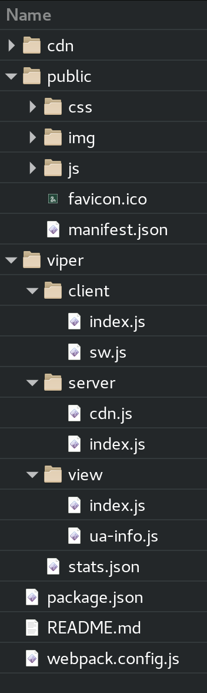

# create-viperhtml-app

A basic [viperHTML](https://github.com/WebReflection/viperHTML) + [hyperHTML](https://github.com/WebReflection/hyperHTML) setup based on [Webpack](https://webpack.js.org/) and with native subclassing capabilities, including Custom Elements.

### How To Start

`npm install` to bring all dependencies in, then `npm run build` whenever you change assets.

To test the example page, just run the usual `npm start`.

### Folders Structure

  * **cdn** contains all optimized on-demand static assets
  * **public** is the actual public site content. It contains few static assets but also JS bundles. You can add CSS bundles too (coming soon)
  * **viper** is where the actual app code is defined, it has at least these subfolders: **client**, for the browser related client-side code, **server**, for the HTTP based back-end service, and **view**, for the external files used either on the client, on the server, or in both, to generate the whole page, or partial content

#### F.A.Q.

  * can I use _express_ or others? Sure you can, this is just a basic setup.
  * how to cleanup _tinyCDN_ cached content? You can simply `rm -rf cdn/*` before re-deploying. _tinyCDN_ gives for granted if a file name is the same, the content must be too. It really works in that sense.
  * how come the example page shows with _hiccups_? It's a demonstration that _viperHTML_ can also render partial asynchronous chunks, no matter in which order these are resolved. You can remove the array of promises from the `body` info of the server `model` and re-test anything you'd like to
 